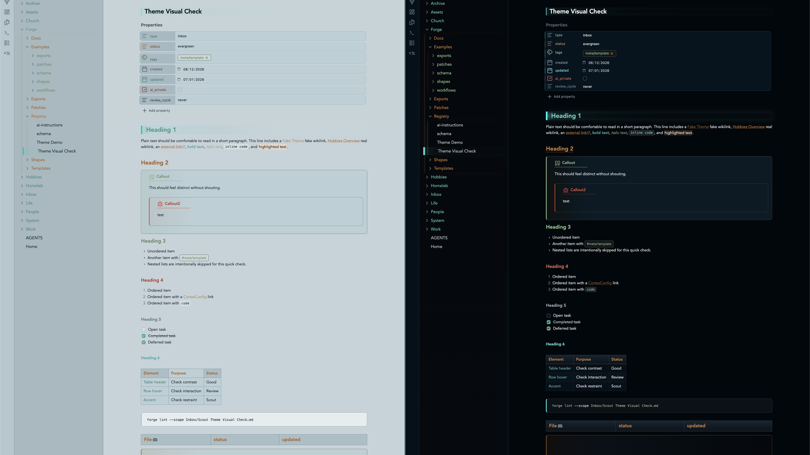

# Night Ridge

Night Ridge is an Obsidian theme for focused notes, technical writing, and vault operations. It is dark, sharp, and low-glare, with small beacon signals for navigation, headings, properties, callouts, and graph work.

The theme uses the Night Ridge palette: moonstone structure, pine accents, copper warmth, lichen support, ember danger, slate neutrals, and sparse seafoam highlights.

Repository: <https://github.com/joshua-walls/night-ridge-theme>



## Design

Night Ridge is meant to feel grounded and practical rather than decorative. It favors clear hierarchy, readable contrast, and small moments of color that help you scan a page without turning every note into a dashboard.

- **Shell and base** give the theme its low-glare command-center foundation.
- **Moonstone and ridge surfaces** structure navigation, properties, tables, callouts, and panels.
- **Pine** is the primary accent for active navigation, links, primary actions, and success.
- **Copper** adds secondary action warmth and warning tone.
- **Lichen** adds organic support for headings and low-frequency variation.
- **Ember** is reserved for error and destructive emphasis.
- **Slate** carries neutral muted UI.
- **Seafoam** stays rare for info, telemetry, and focus-level highlights.

## Features

- Dark and light modes tuned as first-class experiences.
- Beacon-style H1 treatment and subtler inline title beacon.
- Color-rotated folder depth, property rows, and folder rails.
- Forge Health status styling when Forge exposes stable `data-status` hooks.
- Callout hierarchy with quiet fills, strong rails, status-colored icons, and nested-callout restraint.
- Dataview state language for empty, warning, and error states.
- Search result scanner ticks and table command-grid polish.
- Graph colors tuned for quieter links, pine nodes, copper tags, ember unresolved nodes, and seafoam focus.

## Reading Experience

Headings are intentionally expressive. H1 carries a beacon edge, H2 uses copper, and supporting headings rotate through the palette to keep long notes organized. Links, tags, highlights, checkboxes, and inline code each get their own treatment so dense notes remain easy to parse.

Night Ridge is tuned for both Live Preview and Reading View, including long code tokens that should wrap inside code blocks instead of escaping the editor.

## Callouts

Callouts are designed to feel integrated with the page. They use quiet filled surfaces, colored rails, status-colored icons, and a small title underline so they stand out without shouting.

Callout colors follow type, not unrelated vault state:

- `info`, `tip`, `hint` use seafoam.
- `success`, `check`, `done`, `todo` use pine.
- `warning`, `question`, `attention` use copper.
- `danger`, `error`, `failure`, `bug` use ember.
- `note`, `abstract`, and `summary` use slate.
- `quote` and `cite` use lichen.

## Code and Tables

Code blocks use a framed surface with a colored left rail, giving snippets enough presence without overwhelming prose. Inline code is compact and readable, with enough contrast to work inside normal paragraphs.

Tables use a strong header row, clear cell borders, and restrained alternating surfaces. They are meant to support quick comparison in operational notes, documentation, inventories, and reviews.

## Tasks and Metadata

Task checkboxes use Night Ridge accent colors so completed work is obvious without becoming noisy. Metadata and properties are styled as quiet panels that stay readable in both dark and light mode, with a restrained eight-step accent rhythm.

## Forge Support

Night Ridge includes optional styling for Forge Health surfaces. Status colors are applied only when Forge exposes stable hooks such as `data-status` on dashboard sections, section headers, pills, or similar elements.

Expected status mapping:

- good, healthy, clear, valid, indexed -> pine
- warning, needs attention -> copper
- critical, error, fail, failed -> ember
- muted, no note, exempt -> slate

CSS cannot infer Forge state from text alone or style a note pane based on a status that only exists in a separate Forge dashboard pane.

## Install manually

1. Download the latest release zip.
2. Unzip it into your vault's `.obsidian/themes/` folder.
3. In Obsidian, open Settings, then Appearance, then Themes.
4. Select `Night Ridge`.

The installed folder should contain:

```text
Night Ridge/
  manifest.json
  theme.css
```
